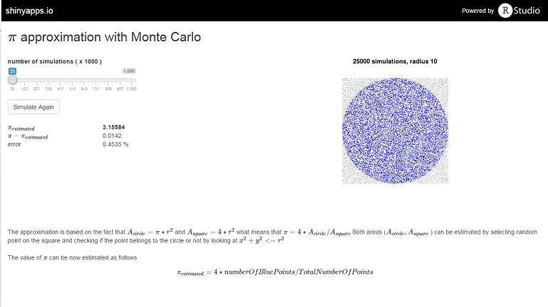

## \\(\\pi\\) and Monte Carlo

  1. \\(\\pi\\) is the ratio of a circle's circumference to its diameter, commonly approximated as 3.14159.

  2. Monte Carlo is a simulation method that relys on repeated random sampling to obtain numerical results.

The purpose of montecarlopi shiny app is to approximate \\(\\pi\\) with very simple Monte Carlo simulation

---

## \\(\\pi\\), squares and circles

Consider a circle inscribed in a square. In this case lenght of the side of the square is \\( 2r \\)

Taking this into account 

\\( A_{circle} = \\pi r ^ 2 \\)

and 

\\( A_{square} = 4 r ^ 2 \\) 

what leads to 

\\( \\pi = 4 A_{circle} / A _ {square} \\)

The only thing to do now is to calculate/estimate \\( A_{circle} \\) and \\( A _ {square}\\) without using \\(\\pi\\)

---

## Monte Carlo

Imagine we choose random point from a square. If we repeat this process and select enough of random points we cover the area of the square and estimate its area.

Consider the same process in combination with the formula for a circle \\( x ^ 2 + y ^ 2 <= r ^ 2 \\). Using this formula we can estimate the area of the circle.

In R it could be implemented as follows

``` {r}
rad <- 1; sim <- 1000;
is.inside <- function(x, y, r) { x^2 + y^2 <= r^2 }
x <- runif(sim,min= -rad ,max= rad ); y <- runif(sim,min= -rad ,max= rad )
pi_est <-  (sum(is.inside(x,y,rad))/sim) * 4
```
The value of \\(\\pi\\) after `r sim` simulations is `r pi_est`

---

## The App

The app allows you to select the number of simulations (from 25K to 1M) and run it on the server. 

As a result you can see the estimated value of \\(\\pi\\) the difference between our estimate and real \\(\\pi\\) and the error in %. On the right side of the page you can see the plot of random points.


